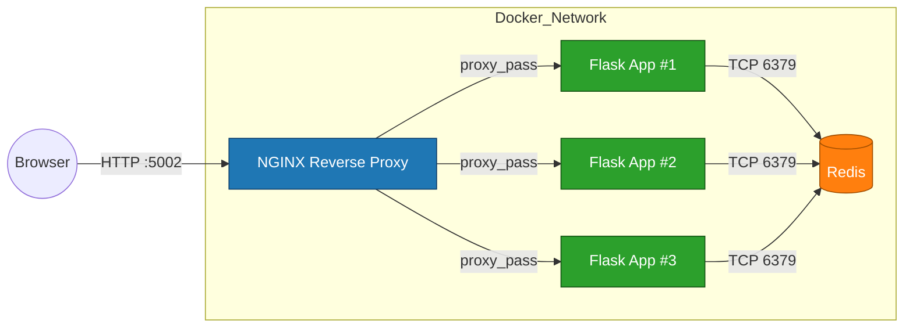

# 🐳 SiteScope — A Containerized Flask + Redis + NGINX Analytics Dashboard

This project is the outcome of the **CoderCo Containers Challenge** — where I built, debugged, and scaled a **multi-container application** from scratch. It may look like a simple counter app, but under the hood it demonstrates many **core DevOps concepts**: containerization, persistence, configuration management, scaling, and load balancing.

This README is written to **showcase my work to recruiters and hiring managers**. It documents not just what I built, but also what I learned and how I solved real-world problems along the way.

---

## 🖼️ Demo — Application in Action


> 🔎 Above: The Flask app running inside Docker containers — the **welcome** route (`/`) and the **counter** route (`/count`) incrementing via **Redis**.

---

## 🧭 Architecture (High Level)



> NGINX listens on **localhost:5002**, load-balances to **three Flask replicas** (exposed on the Docker network), and each app instance reads/writes the counter in **Redis**.

---

## 🎯 The Challenge

**Objective:**

* Create a multi-container application using **Flask** + **Redis**
* Flask has two routes:
  * `/` → Landing Page
  * `/count` → Increments and displays a visit count stored in Redis
* Dockerize both services and orchestrate them with Docker Compose

**Bonus goals:**

* ✅ Persistent storage for Redis (volumes)
* ✅ Use environment variables for flexibility
* ✅ Scale Flask instances & load balance with NGINX

---

## 🛠 Tech Stack

* **Python Flask** → web framework
* **Redis** → in-memory key-value store
* **NGINX** → reverse proxy & load balancer
* **Docker & Docker Compose** → containerization & orchestration

---

## ⚙️ How to Run

```bash
# clone repository
git clone https://github.com/yassinsuleiman/DevOps-Docker-Learning.git
cd DevOps-Docker-Learning/Multi-Container-Project

# build & start
docker compose up --build
```

Visit:

* [http://localhost:5002/](http://localhost:5002/) → Welcome page
* [http://localhost:5002/count](http://localhost:5002/count) → Counter page
* [http://localhost:5002/analytics](http://localhost:5002/analytics) → Analytics dashboard
---

## 🚀 Features Implemented

### 1. Base Application
* Flask routes `/` and `/count`
* Redis as key-value store (`INCR visits`)

### 2. Dockerization
* Custom Dockerfile for Flask
* Official Redis image from Docker Hub
* Orchestration with Docker Compose

### 3. Persistent Storage
* Redis volume mounted to `/data`
* Counts persist across container restarts

### 4. Environment Variables
* Flask app reads Redis host & port via env vars
* Configurable in `docker-compose.yml`

### 5. Scaling with NGINX
* Scaled Flask to **three instances**
* NGINX reverse proxy load balances traffic
* Solves port conflicts & enables high availability

---

## 📚 What I Learned

This project was more than just writing YAML and Python — it was about solving **real-world DevOps problems**:

* **Docker fundamentals**: building custom images, using official ones
* **Orchestration with Compose**: linking containers via service names (DNS)
* **Persistence**: volumes to survive container restarts
* **Config management**: moving from hardcoded values → environment variables
* **Scaling & load balancing**: why we need NGINX in front of multiple replicas
* **Debugging**: fixed YAML indentation errors, Docker daemon issues, wrong filenames (`app.py` vs `count.py`), Redis not persisting
* **Production mindset**: thinking beyond “it works on my machine” → resilience & flexibility

---

## 🌱 Future Improvements

* Add frontend (HTML/CSS/JS) for a polished look
* Secure Redis with password/auth
* Deploy to cloud (AWS ECS, Kubernetes, Azure)
* Add CI/CD pipeline with GitHub Actions

---

## 💼 Why This Project Matters

Although this started as a simple counter app, it represents a **production-like pattern**:

* A web service (Flask)
* A database/cache (Redis)
* A reverse proxy (NGINX)
* All managed by Docker Compose with persistence & scaling

It shows I can:

* Build & debug multi-container systems
* Apply DevOps best practices (persistence, scalability, configuration)
* Document & communicate technical projects clearly

this is not just code — it’s a **showcase of my ability to learn, apply, and ship real DevOps projects**.

---

👤 **Author:** Yassin Suleiman  
📍 Switzerland | DevOps Engineer
